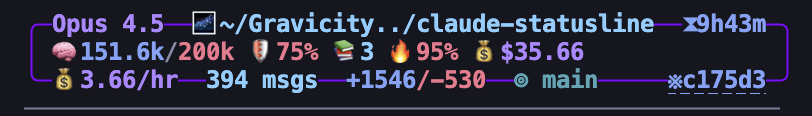
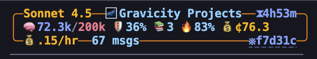
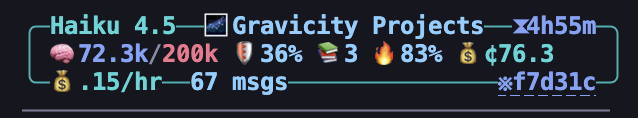

# Claude Code Statusline

A beautiful, feature-rich statusline for [Claude Code](https://docs.anthropic.com/en/docs/claude-code) with animated pulse, model-specific themes, and hierarchical project cost tracking.





## Features

### Model-Specific Themes
Each Claude model gets its own color personality:
- **Opus**: Purple (royal, prestigious)
- **Sonnet**: Orange (warm, creative)
- **Haiku**: Teal (zen, minimal)

### Dynamic 4/5-Line Layout
```
╭─Opus─4.5─🧠─64%─📚─3─💰 2.59/hr
│ 📁 claude-statusline
│ ⚙ phase2-sessi.. ~4 +675-215
│ ⏱ 30h33m 💬2.1K +5.1K-2.3K ※a3013a
╰────────────────◉────── 🛡 94%
```

**Line breakdown:**
| Line | Content |
|------|---------|
| 1 | Model─Version─🧠─Context%─📚─Memory─💰Cost |
| 2 | Icon + Project name |
| 3 | Git: branch ↑ahead ↓behind ●staged ~modified +add-del age |
| 4 | ⏱Duration 💬Messages +Code-Removed ※SessionID |
| 5 | Pulse animation + 🛡Cache% |

*Git line (3) only appears when in a git repo*

### Animated Pulse
- Smooth RGB gradient from theme color to health color (truecolor terminals)
- Traveling orb with particle burst at end
- Health-based coloring (cyan/yellow/red)
- 256-color fallback for Terminal.app compatibility

### Real-Time Stats
- Context usage with health colors
- Memory files count (CLAUDE.md)
- Cycling costs: `/hr` burn rate → session total → `Σ` project total
- Code changes in session (+added/-removed)
- Git: branch, ahead/behind, staged/modified/untracked, diff, commit age
- Cache efficiency percentage
- Clickable session ID (opens transcript)

### Hierarchical Project Cost Tracking
Track costs across sessions with the Session Attribution Model:

```
~/.claude/statusline-project.json        (MASTER - all Claude usage)
├── ~/Projects/.claude/                   (Umbrella project)
│   ├── my-app/.claude/                   (Sub-project)
│   └── other-app/.claude/                (Sub-project)
```

- **MASTER root** at `~/.claude/` tracks total Claude usage across all projects
- **Session ownership**: Sessions belong to the project where they started
- **Breakdown tracking**: Sessions track `{ "_self": X, "child-name": Y }` for accurate attribution
- **Chain roll-up**: Costs propagate up: sub-project → umbrella → MASTER
- **Dedication**: Attribute umbrella session costs to specific sub-projects

## Installation

### Interactive Install (Recommended)

```bash
git clone https://github.com/gravicity/claude-statusline.git
cd claude-statusline
./install.sh
```

The interactive installer (7 steps):
1. **Claude Plan** - API, Max 5x, or Max 20x
2. **Cost Tracking** - Enable per-project tracking
3. **MASTER Root** - Create global tracker at `~/.claude/` (recommended)
4. **Auto-Create Mode** - When to auto-create project configs (see modes below)
5. **Umbrella** - Create umbrella for current directory
6. **Display** - Pulse animation and cost cycling
7. **Install** - Copy script and create config

### Quick Install (with defaults)

```bash
./install.sh --defaults
```

Creates script, config, and MASTER root with sensible defaults.

See [docs/QUICKSTART.md](docs/QUICKSTART.md) for detailed setup instructions.

### One-Liner

```bash
mkdir -p ~/.claude && curl -fsSL https://raw.githubusercontent.com/gravicity/claude-statusline/main/statusline-command.sh -o ~/.claude/statusline-command.sh && chmod +x ~/.claude/statusline-command.sh
```

Then add to `~/.claude/settings.json`:
```json
{
  "statusLine": {
    "type": "command",
    "command": "~/.claude/statusline-command.sh"
  }
}
```

## Configuration

Config file: `~/.claude/statusline-config.json` (optional - sensible defaults used if absent)

```json
{
  "plan": "api",
  "tracking": {
    "enabled": true,
    "auto_create_mode": "claude_folder"
  },
  "display": {
    "pulse_animation": true,
    "cost_cycling": true
  },
  "thresholds": {
    "context_warn": 50,
    "context_crit": 75
  }
}
```

### Auto-Create Modes

| Mode | Projects created when... |
|------|--------------------------|
| `claude_folder` | `.claude/` folder exists (default) |
| `git_only` | Git repository detected |
| `git_and_claude` | Both `.git/` AND `.claude/` exist |
| `always` | Any directory |
| `never` | Manual `--init` only |

**When projects are created:** With `claude_folder` mode (default), statusline projects are created when a `.claude/` folder exists. Claude creates this folder when you run `claude init` or select "don't ask again" for permissions—signaling project-specific intent.

See [docs/CONFIGURATION.md](docs/CONFIGURATION.md) for all options.

## Project Config

Create `.claude/statusline-project.json` in any project:

```json
{
  "name": "my-app",
  "icon": "🚀",
  "color": "#6366F1",
  "git": "https://github.com/user/my-app",
  "parent": "/path/to/umbrella/.claude/statusline-project.json"
}
```

### Hierarchy Setup

```bash
# 1. Create MASTER root (one-time, tracks all Claude usage)
~/.claude/statusline-command.sh --init-master

# 2. Create umbrella for a projects folder
~/.claude/statusline-command.sh --init-umbrella ~/Projects

# 3. Create sub-projects (auto-links to parent)
~/.claude/statusline-command.sh --init ~/Projects/my-app
```

Configs are auto-created based on your `auto_create_mode` setting (default: `claude_folder`).

### Examples

| File | Description |
|------|-------------|
| [example-master.json](example-master.json) | MASTER root config (`~/.claude/`) |
| [example-umbrella.json](example-umbrella.json) | Umbrella project with child tracking |
| [example-project.json](example-project.json) | Sub-project (leaf node) |
| [example-config.json](example-config.json) | User config file |

See [docs/CONFIGURATION.md](docs/CONFIGURATION.md) for detailed hierarchy documentation.

## Updating

```bash
./install.sh --update
```

Or manually:
```bash
curl -fsSL https://raw.githubusercontent.com/gravicity/claude-statusline/main/statusline-command.sh -o ~/.claude/statusline-command.sh
```

See [docs/UPDATING.md](docs/UPDATING.md) for details.

## Uninstall

```bash
./uninstall.sh
```

Or manually:
```bash
rm ~/.claude/statusline-command.sh ~/.claude/statusline-config.json
rm -rf ~/.cache/claude-statusline
```

## Requirements

- Claude Code
- `jq` for JSON parsing
- `bc` for calculations
- Any terminal (256-color minimum, truecolor recommended)

## How It Works

The statusline receives JSON input from Claude Code via stdin:
- Triggered on message updates (300ms debounce)
- Uses Claude's provided cost, model, and line stats
- Parses transcript only for context %, cache %, message count

Cost tracking uses delta attribution:
- Tracks "last known cost" per session
- Only the change (delta) is attributed to current project
- Accurate even when switching between project folders

## Terminal Compatibility

The statusline automatically detects terminal capabilities via `$COLORTERM`:

| Terminal | Truecolor | Features |
|----------|-----------|----------|
| **iTerm2** | ✅ Yes | Full RGB gradients, smooth pulse animation |
| **Kitty** | ✅ Yes | Full RGB gradients, GPU-accelerated |
| **VS Code / Cursor** | ✅ Yes | Full RGB gradients |
| **Warp** | ✅ Yes | Full RGB gradients |
| **macOS Terminal.app** | ❌ No | 256-color fallback, simplified pulse |

### Recommended: Install a Truecolor Terminal

For the best experience with smooth gradient animations:

```bash
# iTerm2 - Feature-rich, macOS native feel
brew install --cask iterm2

# Kitty - Fast, GPU-accelerated, keyboard-driven
brew install --cask kitty
```

### 256-Color Fallback

If your terminal doesn't support truecolor (like macOS Terminal.app), the statusline automatically:
- Uses 256-color palette approximations
- Simplifies pulse animation (moving orb without gradient)
- All functionality works, just less visually fancy

**Detection:** The script checks `$COLORTERM` for `truecolor` or `24bit`. Truecolor terminals set this automatically.

## CLI Commands

```bash
# Initialize MASTER root (tracks all Claude usage)
~/.claude/statusline-command.sh --init-master

# Initialize umbrella project
~/.claude/statusline-command.sh --init-umbrella [path]

# Initialize sub-project
~/.claude/statusline-command.sh --init [path]

# Dedicate session costs to a sub-project
~/.claude/statusline-command.sh --dedicate <session-id> <project-name>

# Sync/reconcile project costs
~/.claude/statusline-command.sh --sync [path]

# Show help
~/.claude/statusline-command.sh --help
```

## License

MIT

---

Built with Claude
